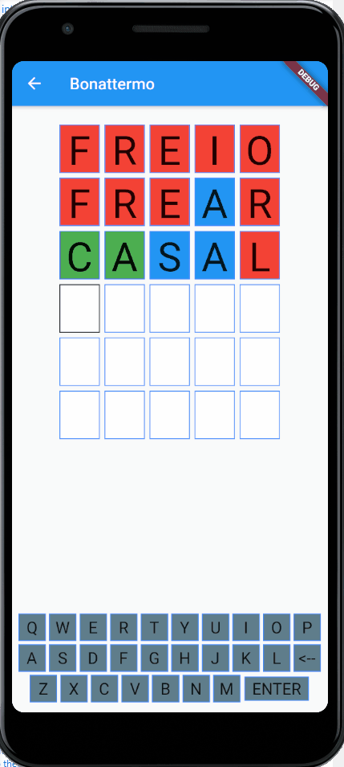

# bonattermo

A word game made in Flutter. It is based in [this game](https://term.ooo/) and uses almost the same [word database](https://github.com/fserb/pt-br).

## Getting Started

After clone this repo, you can use the Helper Project to get the updated list of words.

